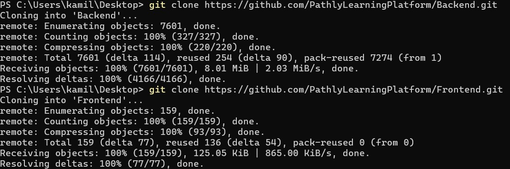
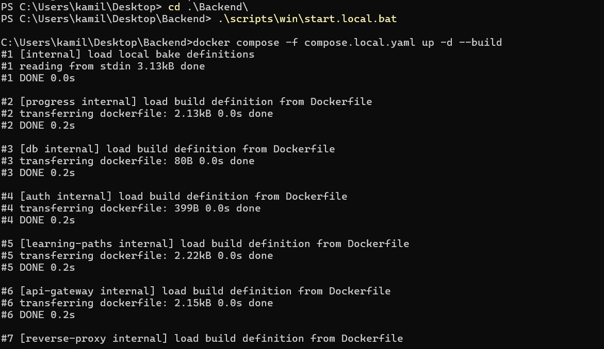
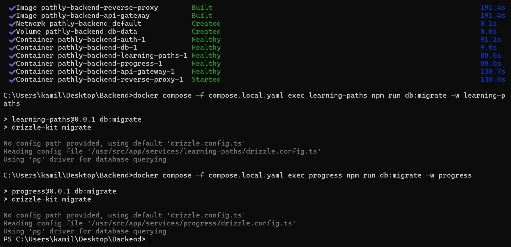
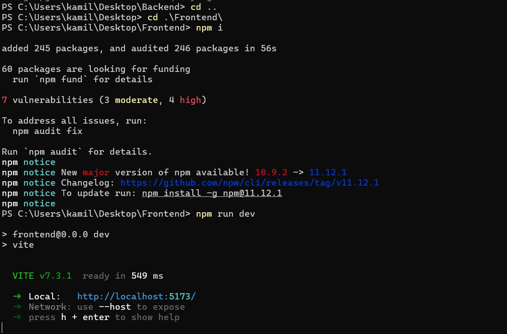
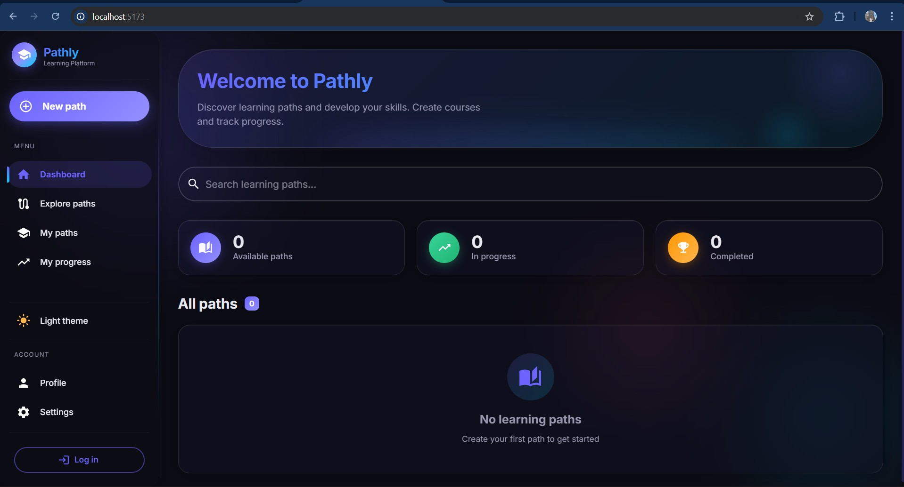

# Jak uruchomić

## Wymagania

- zainstalowany docker ([link do instalacji](https://docs.docker.com/desktop/setup/install/windows-install/))
- zainstalowany NodeJS ([link do instalacji](https://nodejs.org/en/download))
- połączenie z internetem

## Uwagi

- przed uruchomieniem aplikacji upewnij się, że na twoim komputerze porty: `4000` oraz `5173` są wolne.
- upewnij się, że docker jest uruchomiony
- upewnij się, że masz połączenie z internetem
- pierwsze uruchomienie aplikacji może potrwać długo (nawet do kilku minut), ponieważ muszą zostać pobrane wszystkie zależności. Kolejne uruchmienia będą szybsze.

## Proces uruchomienia

- sklonuj repozytorium PathlyLearningPlatform/Backend za pomocą komendy: `git clone https://github.com/PathlyLearningPlatform/Backend.git`
- sklonuj repozytorium PathlyLearningPlatform/Frontend za pomocą komendy: `git clone https://github.com/PathlyLearningPlatform/Frontend.git`

- wejdź do folderu `Backend` komendą: `cd .\Backend`
- uruchom skrypt `start.local.bat` komendą: `.\scripts\win\start.local.bat`

  
- poczekaj aż skrypt się wykona

  
- wyjdź z folderu `Backend` komendą: `cd ..`
- wejdź do folderu `Frontend` komendą: `cd .\Frontend`
- wykonaj komendę `npm i`
- wykonaj komendę `npm run dev`

  
- aplikacja będzie dostępna w przeglądarce pod adresen `http://localhost:5173`

**Podpowiedź**: Jeśli już masz kopie repozytoriów na swoim komputerze, to nie musisz ich drugi raz klonować
